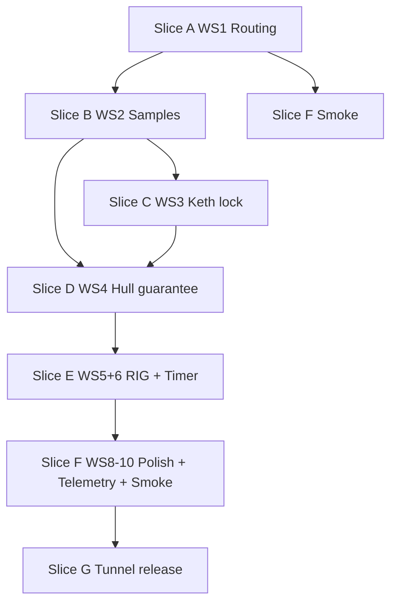

# Round 4 No-Deferral — Full Implementation Plan

**Date:** 2026-06-14  
**Source of truth:** [`round4-no-deferral-rollout-plan-2026-06-14.md`](./round4-no-deferral-rollout-plan-2026-06-14.md)  
**Evidence:** [`round4-tunnel-telemetry-findings-2026-06-14.md`](./round4-tunnel-telemetry-findings-2026-06-14.md)  
**Tunnel surface:** `https://performer-friends-herbs-beaches.trycloudflare.com` (not local Vite)

---

## Executive summary

Human tunnel playtests stay **blocked** until all 11 workstreams pass the rollout’s 21 done criteria and the verification gate at the bottom of this document.

**What is already landed** (commit `46171d1` and prior round-4 work):

| Area | Status |
|------|--------|
| `formatMmSs()` + floored fail-safe copy | Done |
| `ActiveRunPanel` shared on FIELD + RIG | Done (partial vs canonical-RIG goal) |
| Live rig dashboard bars | Done |
| Workshop Thumper / Fabricator station picker | Done |
| `pickPinnedMissionOrder` + settlement reserve **RC** notice | Done |
| `rigEquipmentLock` (open run + unacknowledged result) | Done |
| Experimentation crafting + hold penalty | Done |
| State-aware `resolveNextActionScreen` overlays | Done (incomplete for RIG + `first_orders`) |

**What still blocks release** (ordered by player impact):

1. Post-briefing nav still highlights SETTLEMENT (`first_orders` → `settlement` in `tutorialSteps.ts`).
2. Free tutorial samples do not bind orders (`energyCost > 0` gate in `prospecting.ts`).
3. Tutorial deploys are not Keth-locked on run 1; same-waypoint logic can pick wrong family.
4. Patched 30/30 hull + consumed async waiver → **zero legal deploy tails** (documented hard-stop).
5. Player-facing timer still includes +60s active phase (5m → 6:00, 15m → 16:00).
6. RIG is not canonical: open-run nav → FIELD; FIELD still owns full event/claim surface.
7. Workshop horizontal scroll + fabricator art placement + schematic overlap.
8. Repeatable telemetry + automated browser smoke missing.

**Recommended delivery:** 6 PR-sized slices (below), strict workstream order, no human tunnel test until Slice 6 gate passes.

---

## Done criteria tracker (21 items)

Use this as the release checklist. Mark each only when automated + manual evidence exists.

| # | Criterion | Primary WS | Current |
|---|-----------|------------|---------|
| 1 | After brief, next action = FIELD | WS1 | Red |
| 2 | Foreman never says “pick family on SETTLEMENT” | WS1 | Red |
| 3 | FIELD opens on correct tutorial family + recommended resource | WS1 | Red |
| 4 | Tutorial free samples update order progress immediately | WS2 | Red |
| 5 | Order filled → SETTLEMENT highlighted | WS1/2 | Partial |
| 6 | Tutorial deploys cannot target non-Keth resources | WS3 | Red |
| 7 | Player cannot break first-hull path via target change | WS3 | Red |
| 8 | First-hull materials guaranteed before hull craft expected | WS4 | Partial |
| 9 | No zero-option deploy without visible affordable recovery | WS5 | Red |
| 10 | Active run lifecycle on RIG (timer, events, bars, claim, ack) | WS6 | Partial |
| 11 | FIELD points to RIG during open run | WS6 | Red |
| 12 | Equipment locked open + unacknowledged result | WS6 | Green |
| 13 | 5m deploy does not start at 6:00 | WS7 | Red |
| 14 | Fail-safe / secure-at use `formatMmSs` | WS7 | Green |
| 15 | Workshop stations: no horizontal scrollbar | WS8 | Red |
| 16 | Fabricator art above schematic list | WS8 | Red |
| 17 | Missing-material copy wraps, no overlap | WS8 | Red |
| 18 | Telemetry: sample, deploy, nav, panel, event, workshop | WS9 | Red |
| 19 | domain / db / web checks pass | WS10 | Green (minus smoke) |
| 20 | `first_hull_path_sim.py` prints craftable yes | WS4/10 | Red |
| 21 | Browser smoke covers first session + no-dead-end | WS10 | Red |

---

## PR slice strategy

Implement in this order. Do not start visual polish (WS8) before economy + no-dead-end (WS4–5).

| Slice | Workstreams | Theme | Est. scope |
|-------|-------------|-------|------------|
| **A** | WS1 | Tutorial routing, copy, FIELD defaults | ~8 files, domain + web |
| **B** | WS2 | Free-sample order binding + progress | ~6 files, db + web |
| **C** | WS3 | Keth tutorial deploy lock | ~10 files, domain + db + web |
| **D** | WS4 + WS5 | Hull guarantee + patched-hull emergency run | ~15 files, domain + db + sim |
| **E** | WS6 + WS7 | RIG canonical + timer model | ~12 files, domain + web |
| **F** | WS8 + WS9 + WS10 | Workshop layout, telemetry, Playwright smoke | ~20 files |
| **G** | WS11 | DB reset + tunnel release | Ops only |

After each slice: run the **slice verification commands** listed in that section before merging.

---

## Slice A — WS1: Tutorial routing, copy, defaults

### Problem (confirmed in code)

- `tutorialNextActionScreen('first_orders')` returns `'settlement'` — `packages/domain/src/tutorial/tutorialSteps.ts:33-34`
- Foreman still says “Pick a resource family from the foreman list…” — `apps/web/src/lib/copy/foreman.ts`
- FIELD defaults to `conductive_metal` when session unset — `apps/web/src/lib/server/fieldLoad.ts:331`

### Tasks

#### A1 — Domain: `first_orders` → FIELD

**Files:** `packages/domain/src/tutorial/tutorialSteps.ts`, `tutorialSteps.test.ts`

```ts
case 'first_orders':
  return 'field';  // was 'settlement'
```

Keep `prologue` on SETTLEMENT. `turn_in` stays SETTLEMENT.

#### A2 — Domain: optional reason on resolver (for telemetry WS9)

**Files:** `packages/domain/src/tutorial/resolveNextActionScreen.ts`, `.test.ts`

Extend return type or add parallel `resolveNextActionReason()`:

| Condition | Screen | Reason |
|-----------|--------|--------|
| `first_orders` baseline | `field` | `tutorial_first_order_field` |
| `orderReadyToTurnIn` | `settlement` | `order_ready_turn_in` |
| `settlementBriefingPending` | `settlement` | `settlement_briefing` |
| (defer open-run RIG to Slice E) | | |

#### A3 — Foreman copy tied to pinned order

**Files:** `apps/web/src/lib/copy/foreman.ts`, `apps/web/src/lib/server/settlementLoad.ts`

Replace first-order line with dynamic copy from `pickPinnedMissionOrder()`:

> First order: Structural Alloy. FIELD is tuned for Keth Iron — scan the recommended signal.

For second hand-fill (Conductive Metal / Sorrel Vein Copper), same pattern when step is `hunting` and pinned order is CM.

Remove any copy implying a family picker exists on SETTLEMENT.

#### A4 — FIELD tutorial family defaults

**Files:** `apps/web/src/lib/server/fieldLoad.ts`, `apps/web/src/lib/field/constants.ts`, `apps/web/src/routes/field/+page.server.ts`

Add `defaultFieldFamilyForTutorialStep(step)` in domain or web lib:

| Step | Default family | Recommended slug |
|------|----------------|------------------|
| `first_orders`, first SA order | `structural_alloy` | `keth_iron` |
| `hunting`, CM order | `conductive_metal` | `sorrel_vein_copper` |

Override `session.selectedFamily ?? DEFAULT_FIELD_FAMILY` when tutorial step + pinned order demand it. Persist selection on first FIELD load so refresh stays consistent.

#### A5 — Stale nav after server actions

**Files:** `apps/web/src/routes/+layout.server.ts`, `apps/web/src/lib/server/nextActionLoad.ts`, action responses on settlement/field/rig

Ensure post-action responses include updated `nextActionScreen` or trigger layout invalidation (`invalidateAll` / `depends('app:nextAction')`) after:

- briefing confirm
- sample
- turn-in
- deploy
- claim
- acknowledgement

#### A6 — Tests

| Test | File |
|------|------|
| `tutorialNextActionScreen('first_orders')` → `field` | `tutorialSteps.test.ts` |
| `resolveNextActionScreen` with `first_orders` + no overlays → `field` | `resolveNextActionScreen.test.ts` |
| `defaultFieldFamilyForTutorialStep('first_orders')` → SA | new domain test or fieldLoad unit |
| Foreman line for `first_orders` mentions FIELD, not picker | copy test or snapshot |

### Slice A verification

```bash
rtk pnpm --filter @async-frontier-mmo/domain test -- tutorialSteps resolveNextActionScreen
rtk pnpm --filter web check
```

### Acceptance

- Brief confirm → orange highlight on FIELD.
- SETTLEMENT foreman names pinned order + “go FIELD”.
- FIELD loads Structural Alloy + Keth Iron `[RECOMMENDED]`.

---

## Slice B — WS2: Free sample progress and order binding

### Problem (confirmed in code)

```ts
// packages/db/src/queries/prospecting.ts ~702
if (sampleResult.energyCost > 0) {
  await bindSettlementOrdersOnSample(...)
}
```

`prospecting.test.ts` asserts free samples **do not** bind — must flip.

### Tasks

#### B1 — Tutorial free-sample bind rule

**Files:** `packages/db/src/queries/prospecting.ts`, `settlement.ts`

Bind when **either**:

- `energyCost > 0` (existing paid-sample rule), **or**
- tutorial hand-fill path: free sample + sampled family matches pinned open order family + resource matches recommended slug for that order.

Extract `shouldBindSampleToOrders({ energyCost, tutorialStep, pinnedOrder, sampledResource })` for testability.

Concrete cases:

| Sample | Order | Bind? |
|--------|-------|-------|
| Free Keth Iron | SA first order | Yes |
| Free Sorrel Vein Copper | CM second order | Yes |
| Free Pale Ember | SA order | No |
| Free scout outside tutorial | any | No (show explicit copy) |

#### B2 — Sample result UI

**Files:** `apps/web/src/routes/field/+page.server.ts`, `fieldLoad.ts`, `SampleResultPanel.svelte`

- Return fresh `orderStatusLine` / progress in sample action response.
- If order filled → set nav overlay to SETTLEMENT (wire through `resolveNextActionScreen` + `orderReadyToTurnIn`).

#### B3 — Non-tutorial explicit copy

When free sample does **not** bind (post-tutorial scout):

> Scout sample banked. Foreman orders bind on a paid sample.

Do not show in tutorial hand-fill path after B1.

#### B4 — DECISION_LOG update

**File:** `design-docs/DECISION_LOG.md`

Document reversal: tutorial hand-fill free samples bind immediately; paid-only binding remains for non-tutorial scout.

#### B5 — Tests

**File:** `packages/db/src/queries/prospecting.test.ts`

| Test | Expect |
|------|--------|
| Free Keth during `first_orders` | progress 0 → sampled qty |
| Free Sorrel during CM hunt | progress 0 → sampled qty |
| Wrong-family free sample | no bind |
| Order filled after bind | `orderReadyToTurnIn` true |

### Slice B verification

```bash
rtk pnpm --filter @async-frontier-mmo/db test -- prospecting settlement
rtk pnpm --filter @async-frontier-mmo/domain test -- resolveNextActionScreen
```

### Acceptance

- No `+4u` sample with order still at `0` during tutorial.
- Order filled → SETTLEMENT highlight immediately.

---

## Slice C — WS3: Tutorial thumper target lock (Keth only)

### Problem

- Run 1 deploy has no Keth validation.
- Run 2 only enforces same-waypoint; waypoint may be Sorrel if player sampled wrong resource first.
- Playtest evidence: 96u CM, 1u SA — path broken.

### Tasks

#### C1 — Domain helper: locked tutorial deploy target

**New files:** `packages/domain/src/thumper/tutorialDeploy.ts`, `tutorialDeploy.test.ts`

```ts
export const TUTORIAL_DEPLOY_FAMILY = 'structural_alloy';
export const TUTORIAL_DEPLOY_RESOURCE_SLUG = 'keth_iron';

export function isTutorialDeployLockedStep(step: string | null): boolean;
export function validateTutorialDeployTarget(input: {
  step: string | null;
  targetResourceSlug: string;
  depositSpotId: string;
  lockedSpotId: string | null;
}): { allowed: boolean; reason?: string };
```

Locked waypoint = Keth spot from first bound SA order sample (preferred derivation).

#### C2 — Persist tutorial waypoint pointer

**Files:** `packages/db/src/queries/prospecting.ts` or `settlement.ts`, tutorial state column/table if needed

On first **bound** Keth sample during SA order:

- Persist `tutorialKethWaypointSpotId` (or derive from `listPilotSampledSpots` filtered to Keth + first SA bind timestamp).

If derivation is fragile in SQL, persist explicitly (rollout prefers derive, allows persist).

#### C3 — Server deploy validation

**Files:** `apps/web/src/routes/field/+page.server.ts`, `fieldDeployLoad.ts`, `packages/db/src/queries/thumperRunWorkflow.ts`

For `first_deploy` and `second_deploy`:

- Reject any target where resource slug ≠ `keth_iron`.
- Reject any spot ≠ locked Keth waypoint.
- Return 400 with reason `tutorial_deploy_locked_keth`.

Reject list for tests: Sorrel, Veyrith, Glimmerfall, Pale Ember, any non-Keth.

#### C4 — UI lock

**Files:** `apps/web/src/routes/field/+page.svelte`, `fieldLoad.ts`

During `first_deploy` / `second_deploy`:

- Hide/disable other deploy targets.
- Banner: `Tutorial deploy locked: Keth Iron structural haul.`
- In-world reason: `The first rig trials need structural stock…`
- Second deploy: `Second tutorial deploy must use the locked Keth Iron waypoint.` (not “same as first run”)

#### C5 — Bad-save recovery

**Files:** `tutorialOrchestration.ts` or field load

If existing claimed tutorial run used non-Keth target:

- Route to correction copy / foreman briefing (do not allow continuing starved SA path).
- Document in DECISION_LOG if one-time migration needed.

#### C6 — Tests

| Layer | Coverage |
|-------|----------|
| Domain | `tutorialDeploy.test.ts` — accept/reject matrix |
| DB/web | deploy action rejects Sorrel on run 1 and 2 |
| DB/web | deploy accepts locked Keth waypoint |

### Slice C verification

```bash
rtk pnpm --filter @async-frontier-mmo/domain test -- tutorialDeploy
rtk pnpm --filter @async-frontier-mmo/db test -- thumperRunWorkflow
rtk pnpm --filter web check
```

### Acceptance

- Fresh tutorial: both thump rewards are Structural Alloy from Keth.
- Server rejects wrong-resource POST even with UI disabled.

---

## Slice D — WS4 + WS5: Hull guarantee + no-dead-end

### WS4 — First-hull material guarantee

#### D1 — Extend `first_hull_path_sim.py`

**File:** `design-docs/first_hull_path_sim.py`

Replay exact server path:

1. Brief → Keth free sample bind → SA turn-in  
2. Sorrel free sample bind → CM turn-in  
3. Rig assembly  
4. Tutorial Keth thump ×2 (with WS3 yields)  
5. Fail-safe recall + patch  
6. First async 15m (with event waste haircut)  
7. RC acquisition  
8. Settlement turn-ins consume stacks  
9. Craft Reinforced Hull Plate  

**Exit:** print `Reinforced Hull Plate craftable: yes` or `sys.exit(1)`.

#### D2 — SA protection (choose one — recommended order)

| Option | Pros | Cons |
|--------|------|------|
| **A. Pin hull craft mission until crafted** | Clearest UX | More UI work |
| **B. Reserve 100u SA like RC reserve** | Matches existing `firstHullReserve.ts` pattern | Need stack/instance logic |
| **C. Delay `next_need` orders until hull crafted** | Simple | Less teaching |
| **D. Increase tutorial Keth yield floor** | Fixes math at source | Must stay visible in-world |

**Recommendation:** B + verify with sim. Extend `firstHullReserve.ts`:

```ts
// bonding_matrix already reserves RC 20u
// add structural_alloy reserve 100u for outer + bracing stacks
```

Wire through `settlement.ts` turn-in + `settlementLoad.ts` notice (mirror RC copy).

#### D3 — Yield floor if sim still fails

If sim fails after WS3 Keth lock + SA reserve:

- Prefer visible structural salvage award after second Keth run, **or**
- Tutorial-tier reduced SA bill (document in DECISION_LOG).

No silent hidden grants.

#### D4 — DB integration test

**New file:** `packages/db/src/queries/firstHullPath.test.ts` (or extend `crafting.test.ts`)

Scripted sequence through queries → assert `canCraftReinforcedHullPlate(pilotId)`.

---

### WS5 — Patched hull no-dead-end

#### D5 — Domain: `allowFirstHullEmergencyRun`

**Files:** `packages/domain/src/thumper/deployPreview.ts`, `hullRunCeiling.ts`, tests

Rule:

```
IF !ownsReinforcedHullPlate
AND hull is patched/scavenged at low integrity (30/30 case)
THEN availableTails includes at least one short tail (5 min)
```

**Do not** piggyback on one-time `unlockFirstAsyncTail` waiver.

#### D6 — Server parity

**Files:** `fieldDeployLoad.ts`, `field/+page.server.ts`, `thumperRunWorkflow.ts`

Load and deploy action must use same `allowFirstHullEmergencyRun` flag.

#### D7 — Copy fix

**Files:** `foreman.ts`, `fieldLoad.ts` deploy panel

Replace conflicting messages:

> Patched hull can limp through one short recovery run. Craft Reinforced Hull Plate to unlock real tails.

Show the actual 5m (or emergency) tail button beside copy.

#### D8 — Hard-stop smoke fixture

Seed DB state matching findings doc:

- Patched hull 30/30  
- First async waiver consumed  
- `next_need` orders open  
- Assert ≥1 legal deploy tail OR visible affordable patch

#### D9 — Tests

| Test | Expect |
|------|--------|
| `availableTails(patched, 30, { allowFirstHullEmergencyRun: true })` | includes 5m |
| After hull crafted | emergency rule off |
| Deploy action in hard-stop fixture | accepts emergency tail |

### Slice D verification

```bash
rtk python design-docs/first_hull_path_sim.py
rtk pnpm --filter @async-frontier-mmo/domain test -- deployPreview hullRunCeiling firstHull
rtk pnpm --filter @async-frontier-mmo/db test -- settlement crafting firstHull
```

### Acceptance

- Sim prints `Reinforced Hull Plate craftable: yes`.
- Findings-doc hard-stop state has legal next action.
- RC/SA for hull not consumed by `next_need` turn-ins.

---

## Slice E — WS6 + WS7: RIG canonical + timers

### WS6 — RIG is canonical active deployment

#### E1 — Extend `TutorialScreenId` usage for open runs

**Files:** `resolveNextActionScreen.ts`, `nextActionLoad.ts`, `+layout.svelte`

Add inputs:

```ts
openRunActive: boolean;
eventPendingOnRig: boolean;
claimPendingOnRig: boolean;  // replaces claimPendingOnField
```

Overlay rules:

| State | Highlight |
|-------|-----------|
| Open run | `rig` |
| Event window open | `rig` |
| Claimable | `rig` |
| Unacknowledged result | `rig` |
| Post-ack foreman briefing | `settlement` |

Remove `claimPendingOnField` → `field` branch.

#### E2 — FIELD during open run

**Files:** `fieldLoad.ts`, `field/+page.svelte`, `field/+page.server.ts`

- Hide deploy controls when open run exists.
- Show: `Rig deployed — monitor events on RIG.`
- Remove or slim `ActiveRunPanel` on FIELD (keep map/survey only).
- Block / redirect `respondEventWindow`, `claim`, `acknowledge` on FIELD → 400 with “use RIG”.

#### E3 — RIG owns actions

**Files:** `rig/+page.server.ts` (already has claim/event/ack — verify complete)

Ensure event response does not navigate away or destroy panel state.

#### E4 — Polling

Remove duplicate FIELD polling if FIELD no longer renders active panel.

#### E5 — Equipment lock

Already green — verify still wired after FIELD slim-down.

---

### WS7 — Timer and duration consistency

#### E6 — Player-facing duration = tail only

**Files:** `deployPreview.ts`, `deployPreview.test.ts`, `field/+page.server.ts`, `ActiveRunPanel.svelte`

**Preferred model (rollout):**

- 5m button → store/display **300s**
- 15m button → store/display **900s**
- Event scheduling fits inside displayed duration
- `ACTIVE_PHASE_SECONDS` must not add +60s to visible countdown

If internal active phase kept for mechanics, it must not extend the player-facing timer (absorb into tail window or schedule events within tail).

Update `deployPreview.test.ts` (currently expects 900+60).

#### E7 — Shared formatting audit

Grep for raw seconds in UI; ensure all use `formatMmSs`.

### Slice E verification

```bash
rtk pnpm --filter @async-frontier-mmo/domain test -- resolveNextActionScreen deployPreview formatMmSs
rtk pnpm --filter web check
# Manual: docs/testing/rig-active-deployment-browser-smoke.md
```

### Acceptance

- Deploy → RIG highlighted; event click keeps panel on RIG.
- `/rig` after navigate away shows current run until ack.
- 15m deploy starts at ≤15:00, not 16:00.

---

## Slice F — WS8 + WS9 + WS10: Polish, telemetry, automation

### WS8 — Workshop layout

#### F1 — Remove horizontal ASCII scroll

**Files:** `workshop/+page.svelte`, `SchematicDiagram.svelte`, `theme.css`

- Replace `overflow-x: auto` with responsive layout.
- Smaller monospace at narrow widths; shorter ASCII variants if needed.

#### F2 — Fabricator art above schematics

**Files:** `workshop/+page.svelte`, `WorkshopBench.svelte`

Restructure station panel:

```
[Fabricator ASCII art]
[Schematic list]
[Bench / craft controls]
```

(Thumper station keeps art-above-list pattern.)

#### F3 — Schematic row layout

**Files:** `SchematicList.svelte`

- Line 1: name  
- Line 2: status / missing materials (wrapped)  
- Remove `justify-content: space-between` for long copy.

#### F4 — Hull plate blocker lines

Separate lines for SA, Bonding Matrix/RC, suggested next action.

---

### WS9 — Telemetry expansion

#### F5 — Event names

**File:** `packages/db/src/playtest/eventNames.ts`

Add:

- `field_sample_completed`
- `next_action_resolved`
- `deploy_attempted`
- `active_run_panel_rendered`
- `rig_event_response_submitted`
- `workshop_station_viewed`
- `tutorial_recovery_state`

#### F6 — Recording helpers

**Files:** `packages/db/src/queries/playtestTelemetry.ts`, `apps/web/src/lib/server/playtestTelemetry.ts`

Add `recordPlaytestEvent` (repeatable, not `Once`) with typed payloads per rollout spec.

#### F7 — Wire emit points

| Event | Where |
|-------|-------|
| `field_sample_completed` | `field/+page.server.ts` sample action |
| `next_action_resolved` | `nextActionLoad.ts` / layout |
| `deploy_attempted` | `field/+page.server.ts` deploy (success + fail) |
| `active_run_panel_rendered` | `ActiveRunPanel.svelte` `onMount` / poll tick (throttle) |
| `rig_event_response_submitted` | `rig/+page.server.ts` |
| `workshop_station_viewed` | `workshop/+page.server.ts` load |
| `tutorial_recovery_state` | `fieldDeployLoad.ts` when emergency tail offered |

---

### WS10 — Automated gates

#### F8 — Playwright smoke

**New:** `apps/web/tests/first-session.smoke.spec.ts`  
**Script:** `apps/web/package.json` → `"smoke:browser": "playwright test"`

Cover rollout §WS10 path (see source doc lines 744–782):

- Fresh pilot cookie  
- Brief → FIELD highlight  
- Keth sample progress  
- Orders ×2  
- Rig assembly  
- Keth deploy lock rejection  
- RIG active panel + event  
- Timer ≤ chosen tail  
- No dead-end after async  
- Workshop scroll width assertions  

#### F9 — Workshop visual assertions

In smoke or separate spec:

- `document.body.scrollWidth === viewport.width`
- ASCII containers: `scrollWidth <= clientWidth`
- Missing-material bounding boxes do not overlap schematic name (Playwright `boundingBox` compare).

#### F10 — Wire CI / local gate script

Optional root script aggregating all verification commands from rollout.

### Slice F verification

```bash
rtk pnpm --filter web check
rtk pnpm --filter web smoke:browser
rtk python design-docs/first_hull_path_sim.py
rtk python design-docs/energy_regime_sim.py
rtk python design-docs/sampling_ratio_sim.py
```

---

## Slice G — WS11: Tunnel reset and human release

**Only after Slices A–F pass.**

1. Preserve failing pilot `35df847b-…` evidence (export or tag DB snapshot).
2. Reset tunnel DB: drop `public` + `drizzle`, migrate fresh.
3. `curl -I` tunnel `/settlement` → 200.
4. Human test: incognito or clear `pilot_id` cookie.
5. File comprehension notes in `docs/playtests/post-test-comprehension-template.md`.

---

## Full verification gate (copy before human playtest)

```bash
rtk pnpm --filter @async-frontier-mmo/domain check
rtk pnpm --filter @async-frontier-mmo/domain test
rtk pnpm --filter @async-frontier-mmo/db check
rtk pnpm --filter @async-frontier-mmo/db test
rtk pnpm --filter web check
rtk python design-docs/first_hull_path_sim.py
rtk python design-docs/energy_regime_sim.py
rtk python design-docs/sampling_ratio_sim.py
rtk pnpm --filter web smoke:browser
```

If DB tests hit sandbox `tsx` pipe issue, rerun unsandboxed with approved `rtk pnpm exec tsx`.

---

## Dependency graph



**Critical path:** A → B → C → D (WS5) → E → F → G

WS8 can overlap late E if economy slices are green; do not merge WS8 before D5 (emergency run) is proven.

---

## Preserved fixes — do not regress

When implementing, keep these round-4 items intact:

- `formatMmSs()` everywhere for display times  
- ASCII footer `HULL nn%`  
- Live rig dashboard bars in `ActiveRunPanel`  
- Thumper / Fabricator station picker  
- Settlement acknowledgement lines  
- `pickPinnedMissionOrder` stability  
- Overdrive scrap debit DB test  
- `rigEquipmentLock.ts` for open + unacknowledged result  

---

## Agent execution notes

### Parallelization

| Can parallelize | Must be sequential |
|-----------------|-------------------|
| WS8 layout CSS after D/E contracts frozen | WS1 before WS2 (FIELD defaults need routing) |
| Telemetry event names (F5) while D in progress | WS3 before WS4 sim |
| Playwright skeleton (F8) with mocked steps | WS5 before smoke no-dead-end assertions |

### Per-slice handoff template

Each PR description should include:

1. Workstream / slice ID  
2. Done criteria numbers closed  
3. Tests added/updated (file list)  
4. Manual checks run  
5. Known tradeoffs (DECISION_LOG entry if any)  
6. Remaining red criteria  

### Decision log entries expected

| Topic | When |
|-------|------|
| Tutorial free samples bind | Slice B |
| Keth-only tutorial deploy lock | Slice C |
| SA reserve / yield floor choice | Slice D |
| Emergency patched-hull run rule | Slice D |
| Timer model (tail-only vs setup label) | Slice E |
| RIG canonical (FIELD redirect) | Slice E |

---

## Implementation summary template (fill at release)

```markdown
## Round 4 No-Deferral — Implementation Summary

**Date completed:**
**Tunnel URL:**
**Fresh pilot ID:**

### Done criteria
- [ ] 1–21 all green

### Commands
| Command | Result |
|---------|--------|
| domain check | |
| domain test | |
| db check | |
| db test | |
| web check | |
| first_hull_path_sim.py | |
| energy_regime_sim.py | |
| sampling_ratio_sim.py | |
| smoke:browser | |

### Tradeoffs chosen
- SA protection: (A/B/C/D)
- Emergency run: (tail minutes / repair path)
- Timer model: (tail-only / other)

### Human playtest
- Comprehension doc link:
- Blockers found:
```

---

## Related docs

| Doc | Role |
|-----|------|
| [`round4-no-deferral-rollout-plan-2026-06-14.md`](./round4-no-deferral-rollout-plan-2026-06-14.md) | Requirements + acceptance |
| [`round4-tunnel-telemetry-findings-2026-06-14.md`](./round4-tunnel-telemetry-findings-2026-06-14.md) | Failure evidence |
| [`../round4-playtest-fixes-2026-06-13.md`](../round4-playtest-fixes-2026-06-13.md) | Groups 1–7 (mostly done) |
| [`../round4-end-to-end-fix-plan-2026-06-14.md`](../round4-end-to-end-fix-plan-2026-06-14.md) | ActiveRunPanel + RC reserve (mostly done) |
| [`../testing/rig-active-deployment-browser-smoke.md`](../testing/rig-active-deployment-browser-smoke.md) | Manual RIG smoke until Playwright lands |
